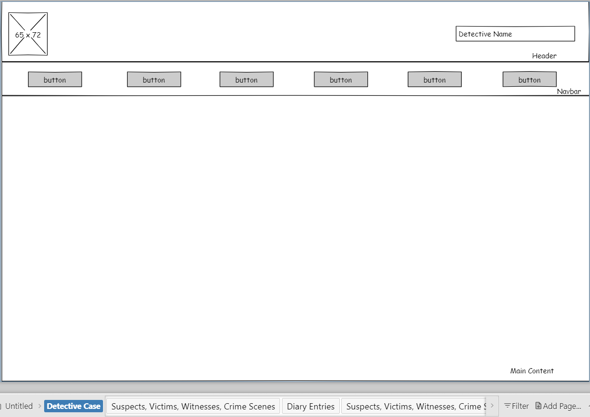
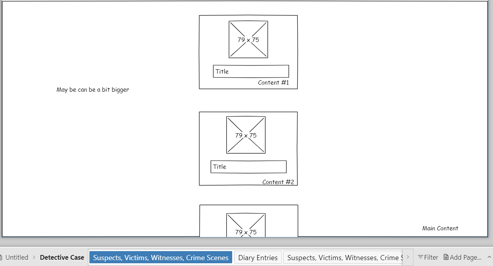
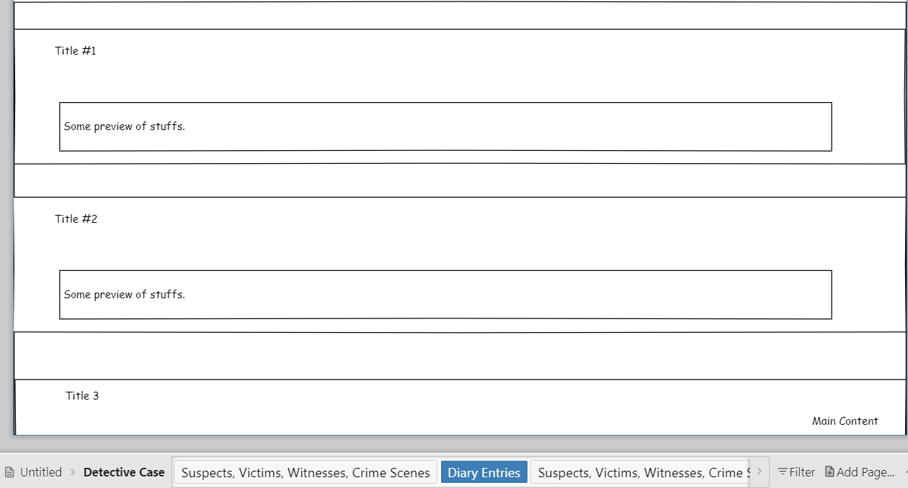
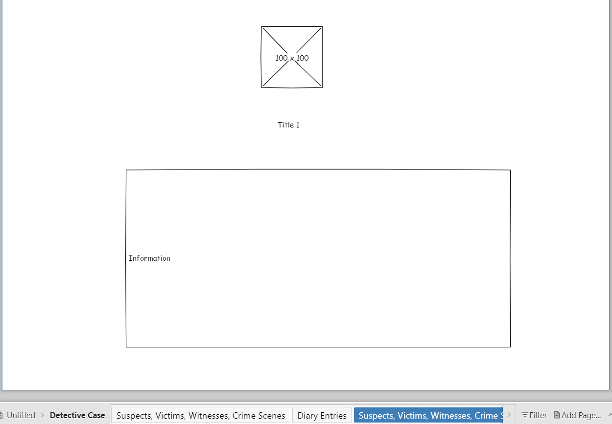
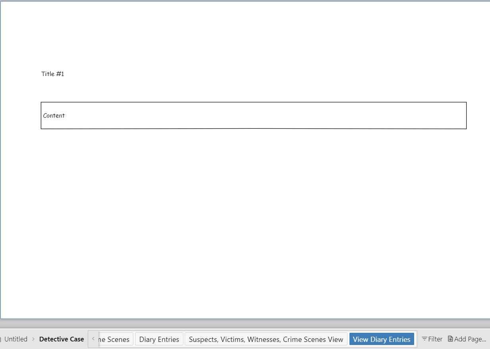

# Project Name: Detective Corner
Detective Kumar could feel that he was going insane. However, he still had one ongoing case. You have been hired by the detective to create a static website to leave information regarding the case so that anyone can solve it when the time comes.

**Challenge:** Make the website as a single-page application using vanilla JavaScript.

Start Date: 29/08/2023

End Date: 

## Functionalities
### Visitors can: 
- [ ] get information about the possible suspects (minimum 5)
- [ ] get information about the victims (minimum 3) 
- [ ] get information about the crime scenes (minimum 3)
- [ ] get information about the diary entries (minimum 4)
- [ ] get information about the witnesses (minimum 6)

## Wireframing
### Main Layout

### Suspects, Victims, Witnesses, Crime Scenes

### Diary Entries

### View Suspects, Victims, Witnesses, Crime Scenes

### View Diary Entries

## Daily Log

### Day 1 (30/08/2023)

Today I finished up the the routing, the server and connection stuff. Do a bit of CSS stuff too.

I'll continue tomorrow populate it with datas and stuffs

### Day 2 (31/08/2023)

